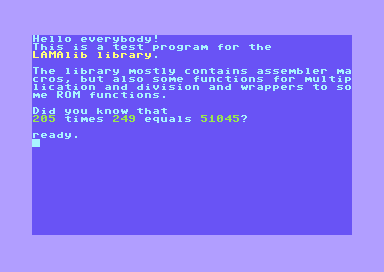
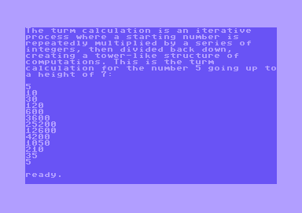
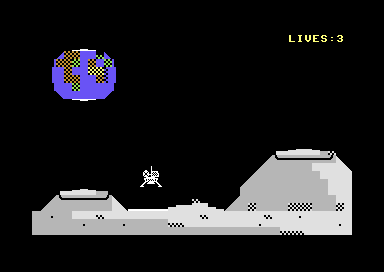
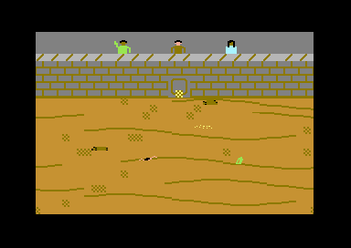

# LAMAlib
## Lightweight Assembler MAcro library for cc65

[](http://unlicense.org/)

LAMAlib is a comprehensive macro library that brings modern programming conveniences to 6502 assembly development. Write cleaner, more maintainable code for the Commodore 64, C128, and VIC-20 with high-level constructs, 16-bit operations, and powerful abstractions—all while maintaining full control over your assembly code.

### Why LAMAlib?

- **16-bit operations made easy**: Work with 16-bit values using intuitive macros like `ldax`, `addax`, `cmpax`
- **Structured programming**: Use `if/then/else`, `do/loop`, and `while` constructs in assembly
- **Zero overhead by default**: Macros only generate code when you use them—no bloat
- **Modular design**: Include only what you need with separate modules for sprites, graphics, and more
- **Battle-tested**: Used in numerous game jam entries and retro projects

---

## Quick Example

```asm
.include "LAMAlib.inc"

ldax #$1234                     ; load a 16 bit value into registers A/X
clc
adcax #$2345                    ; add another 16 bit value
stax $C000                      ; store result

set_cursor_pos 10,0
print "The result is ",($C000)  ; print the result to the screen

getkey                          ; waiting for keypress
rts
```

---

## Features Showcase

### 16-bit Arithmetic
```asm
ldax #$1000                     ; Load 16-bit value
addax #$0500                    ; Add without carry
subax #$0200                    ; Subtract without carry
mulax #$0313                    ; Multiply AX by $313
divax #$0420                    ; Divide AX by $420
cmpax #$1300                    ; Compare 16-bit values, sets Z and C flag like CMP
```

### Structured Programming
```asm
ldx #10
do
  lda table,x
  if ge #$80                    ; if A >= $80
    print "High value!"
  else
    print "Low value!"
  endif
  dex
loop while ne                   ; while X != 0
```

### Sprite Control
```asm
.include "LAMAlib-sprites.inc"

showSprite 0
setSpriteColor 0,#RED
setSpriteXY 0,#100,#150
setSpriteCostume 0,#13
enableMultiColorSprite 0
```

### High-Level Print Functions
```asm
print "Score: ",(score)         ; Print string + variable
print "X=",X," Y=",Y            ; Print multiple values
```

### Screen and Graphics Helpers
```asm
clrscr                          ; Clear screen
set_cursor_pos 12,10            ; Position cursor (col, row)
poke $400,42                    ; Poke to screen memory
textcolor 7                     ; Set text color
```

---

## Installation

1. Clone or download this repository
2. Run the included installation script:
   ```bash
   ./install_lamalib
   ```
3. Include LAMAlib in your programs:
   ```asm
   .include "LAMAlib.inc"
   ```
4. Assemble using the `ass` helper script:
   ```bash
   ass yourprog.s
   ```

For detailed installation options and platform-specific instructions (C64/C128/VIC-20), see the [full documentation](LAMAlibdoc.md).

---

## Examples

### Hello World on Multiple Systems


### Turm Calculation Demo
A demonstration of high-level expressions, loops, and text output:



---

## Games and Projects Made with LAMAlib

Many games at the [One Hour Game Jam](https://onehourgamejam.com/?page=author&author=frodewin) have been created with LAMAlib, demonstrating its effectiveness for rapid retro game development.

### Featured Projects

#### Moonlander
A lunar landing game with physics simulation



#### Olympic Splashdown
Olympic-themed sports game



Both games are available with full source code at [github.com/demesos/retrobits](https://github.com/demesos/retrobits)

---

## Modules

LAMAlib includes reusable modules for common tasks:

- **copycharset**: Copy and modify character sets with effects (italic, reverse)
- **mousedriver**: 1351 mouse and joystick input handling
- **polychars**: Display more than 256 characters on screen simultaneously
- **PETSCII display**: Decode and display PETSCII encoded text
- **topdownscroller**: Multi-column text scrolling with variable speeds

---

## Developer Tools

LAMAlib comes with helpful development tools:

- **`ass`**: Quick assembly script for C64/C128/VIC-20
- **`asdent`**: Automatic indentation formatter for assembly source
- **`exprass`**: High-level expression translator (converts `let A=PEEK(1024+X+40*Y)` to assembly)

---

## Documentation

ߓ **Full API Reference**: [LAMAlibdoc.md](LAMAlibdoc.md)

Complete documentation of all macros, modules, and features.

---

## License

This project is released under [The Unlicense](http://unlicense.org/) - public domain. Use it freely in any project, commercial or otherwise.

---

## Contributing

Contributions, bug reports, and feature requests are welcome! Feel free to open an issue or submit a pull request.

---

## About

LAMAlib was created to make 6502 assembly programming more accessible and enjoyable while maintaining the power and control that assembly provides. Whether you're a game jam participant or working on a larger retro project, LAMAlib helps you write better code faster.

**Author**: Wilfried Elmenreich  
**GitHub**: https://github.com/demesos/LAMAlib
